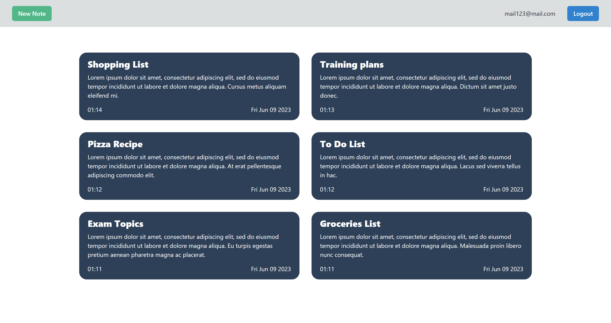
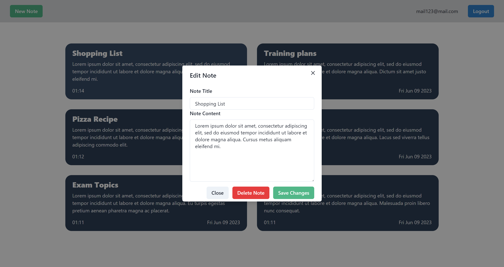

# Personal Notes App: Frontend
Frontend of a personal notes web app.  
Built with React, Chakra UI, Node.js, Axios, and Firebase.

## Description
Frontend of a personal notes web app, built with React and Node.js.  
Allows for user authentication using Google OAuth and Firebase.  
Makes requests to the backend server of the app using HTTP GET, POST and PUT methods.  
Users are allowed to create, edit and delete personal notes.  

## Screenshots




## How to run
```bash
npm install
npm run start
```
